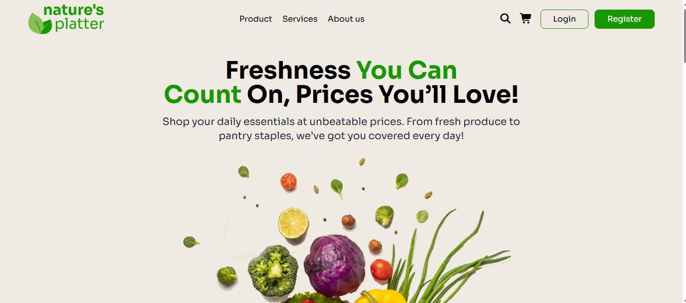

# Nature's Platter

A modern, responsive e-commerce web project designed for online grocery shopping and daily household essentials, featuring a clean layout, vibrant aesthetics, and a fully adaptable interface.

**GitHub Repo:** [https://github.com/mrrakib5007/natures-platter.git](https://github.com/mrrakib5007/natures-platter.git) 

**Live Preview:** [https://natures-platter1.netlify.app](https://natures-platter1.netlify.app)

## Site Preview

<div align="center">
  
</div>

## Key Features

- **Modern UI/UX Design:** Crafted using the latest Tailwind CSS version, ensuring a seamless and fully responsive experience across mobile, tablet, and desktop devices.
- **Attractive Hero & Banner Section:** Eye-catching introductory section highlighting freshness, affordable pricing, and daily essentials.
- **Dedicated Services Section:** Showcases 24/7 customer support, fast delivery, and healthy product guarantees with interactive hover effects.
- **Popular Products & Discounts:** Clean grid layout displaying popular grocery items along with special discount cards (e.g., up to 30% off).
- **Special Offers & Deals:** Promotional banners for partner brands with high discounts.
- **Newsletter Subscription:** Fully styled subscription section to keep users updated with exclusive tips, product deals, and news.

## Technologies Used

- **HTML5**
- **Tailwind CSS v4** (Modern CDN approach)
- **Font Awesome 7** (For icons)
- **Google Fonts** (Sora font family)

## Project Structure

```text
nature-platter/
├── index.html
├── style.css
└── assets/
    ├── site_preview.png
    ├── nav-logo.png
    ├── footer-logo.png
    ├── Hero Section 1.png
    ├── service.png
    ├── delivery.png
    ├── products.png
    ├── mask-group.png
    ├── onion.png
    ├── dawat-logo.png
    ├── gate-logo.png
    ├── offers-1.png
    ├── offers-2.png
    └── grocery-basket.png

```

## How to Run

1. Clone or download the repository to your local machine.
2. Open the `index.html` file in any modern web browser.

*Developed with ❤️ by **MrRakib5007***